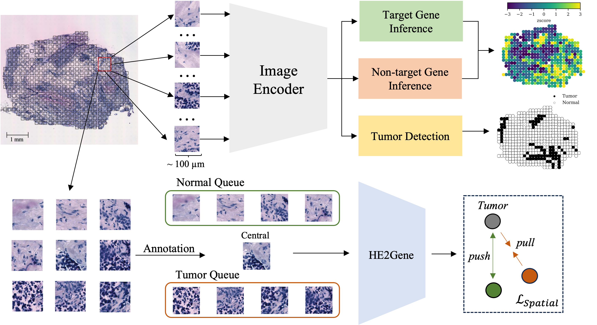

# HE2Gene: Image-to-RNA Translation via Multi-task Learning for Spatial Transcriptomics Data
<p align="center">

</p>

## HE2Gene
**HE2Gene** is a multi-task Learning framework that can simultaneously predict Gene Expression and Pathological Annotations for Spatial Transcriptomics. This document introduces the procedures required for replicating the results in *HE2Gene: Image-to-RNA Translation via Multi-task Learning for Spatial Transcriptomics Data*

## Abstract
Tissue context and molecular profiling are commonly used measures in understanding normal development and disease pathology. In recent years, the development of spatial molecular profiling technologies (e.g., spatial transcriptomics) has enabled the exploration of quantitative links between tissue morphology and gene expression. However, these methods remain expensive and time-consuming, with subsequent spatial transcriptomic analyses necessitating high-throughput spot-level pathological annotations. On the other hand, existing computational methods could be limited to only a few dozen to several hundred genes. Furthermore, the majority of those methods are originally designed for bulk RNA-seq. In this context, we proposed HE2Gene, a deep learning-based method for predicting spatial Gene expression from Hematoxylin and Eosin (H\&E)-stained images. By leveraging multi-task learning and patch-based spatial dependencies, HE2Gene successfully annotates the expression of tens of thousands of genes along with spot-level pathological annotations. Experimental results demonstrate that HE2Gene is comparable to state-of-the-art methods and generalizes well on an external dataset without the need for re-training. Moreover, HE2Gene preserves the annotated spatial domains and has the potential to identify biomarkers, which not only enables tumor detection but also allows for the extension of HE2Gene to investigate gene-disease associations.

## Overview
HE2Gene is trained to simultaneously infer the gene expression and pathological annotations of tissue samples from its corresponding histological image. To achieve it, a collection of training samples, each with a matched whole-slide H\&E-stained image, the position coordinates of each spot in the image, as well as the gene expression profiles and pathological annotations are taken. The resulting gene expression and pathological annotations are spatially resolved, allowing integration with the input histology image to create a comprehensive tissue data modality that encompasses spatial, genomic-scale, tumor phenotype, and morphology information. Specifically, the HE2Gene methodology consists of the following steps: Firstly, spot patches within the whole-slide image are segmented using the provided position coordinates. Subsequently, the histology image is divided into numerous non-overlapping square tiles, with each tile covering an area of approximately 100 × 100 $\mu m^2$. Next, normalization techniques are applied to address domain discrepancies between the histology images and gene expression data. A multi-task learning framework with spatial-aware constraint is then proposed to translate each histology image tile into a cellular profile and pathological annotation simultaneously. Finally, the model assigns profiles and annotations to each candidate tile, resulting in complete gene expression and pathological annotations for the tissue of interest simultaneously.


## Datasets
We analyzed two publicly available spatial transcriptomic datasets. The images and gene expression profiles are available at (https://data.mendeley.com/datasets/29ntw7sh4r/5) for the HBCIS dataset and (https://github.com/almaan/her2st) for the HER2+ dataset.

An example dataset shown in data/exps are used for demonstration.


## Pre-trained models
The HE2Gene_Base and HE2Gene_Spat pretrained models can be download from https://drive.google.com/file/d/17Vo9pXtFvxF9AmnXVrjsjcYsU0CY0fz2/view?usp=drive_link and https://drive.google.com/file/d/1r2-JlkHXDLD8iwnwkkw1aoYlWrjQg1ss/view?usp=drive_link.

## Single patch prediction 

Single patch prediction are based on HE2Gene-Base, to perform gene inference based on single spot patches, please put your patch images into the data/exps folder and then run 
```sh
python3 ./src/patch_pred.py ./data/exps -image_size 224 --batch_size 8
```
the script will generate 3 files in the output folder which are the expression levels of target 250 genes, the expression levels of 19699 auxiliary genes, and the pathological annotation, i.e., tumor or normal.


## Whole slide prediction


Whole slide prediction are based on HE2Gene-Spat since it considers the patch-based spatial dependencies, to perform gene inference based on whole-slide image, run 
```sh
python3 ./src/slide_pred.py --root ./data/exps -image_size 224 --batch_size 1
```
The script will also generate 3 files in the output folder for target 250 genes, 19699 auxiliary genes, and the pathological annotation. Please note that the image name in the exps folder should be in the following format:

'patient/section id'_x_y.tif

where x and y are the spatial coordinates obtained by spatial transcriptomics technology.


## Train using your own datasets

To perform the training from scratch with defaults parameters, run 
```sh
python3 he2gene-base.py
``` 

To perform HE2Gene with spatial-aware constraint, run 
```sh
python3 he2gene-spat.py
```
You can revise the defalut parameters by revise the params dict or the script input:

parser.add_argument('--aux', type=float, default=20.0, help='weight for aux loss')
parser.add_argument('--tmr', type=float, default=1.0, help='weight for tmr loss')

params = {
    "crop_size": 150,
    "image_size": 224,
    "batch_size": 256,   
    "num_workers": 8,
    "learning_rate": 1e-5,
    "weight_decay": 1e-4,
    "epochs": 100,
    "patience": 10,
    }

To generate the gene map for whole-slide image, run 
```sh
python3 ./src/visualize.py predictions.npz --gene A1BG
``` 


